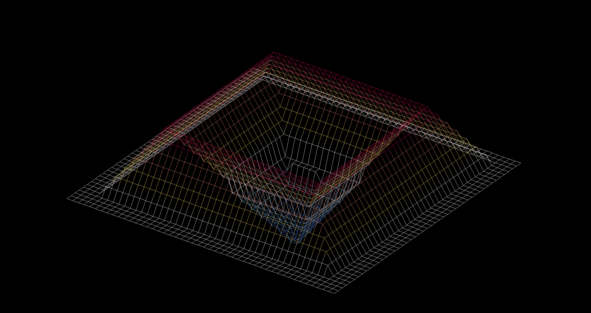
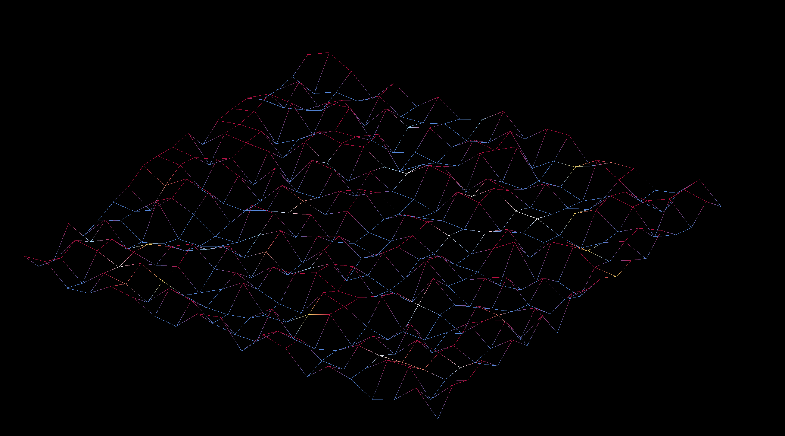
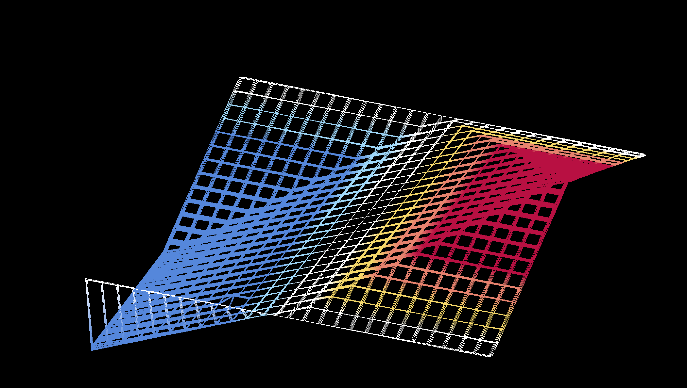

# 42_wireframe

a wireframe rendition of customizable maps. Done as part of the 42 graphics branch. Feel free to make your own maps.

enjoy ^-^

## Start

use 'make' then './fdf mapname' to start the program. maps are provided in the test_maps folder.

## Input

mouse up/down to change height

mouse left/right to rotate

space - turn on/off delete after change.

Look through the code for other settings. 

## Screenshots

